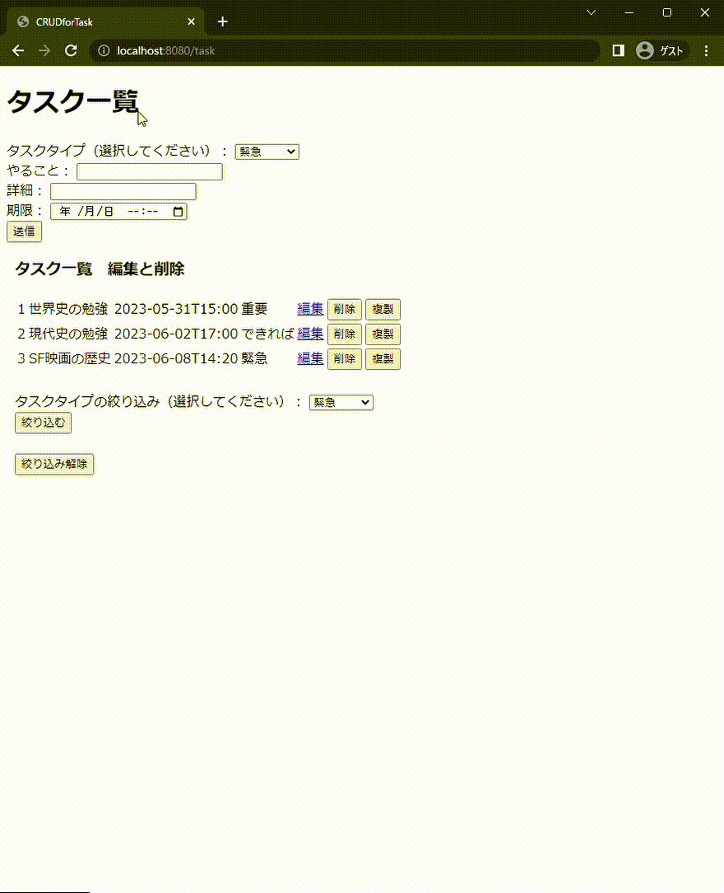

# タスク管理アプリ（spring）
***

***

##使用環境

*統合開発環境-----ECLIPSE2020
*JAVA-------------JAVA11
*フレームワーク---springbootver
*データベース-----h2-database
*webサーバ--------Tomcat v9.0

## 主な機能

* 「springboot」で開発したタスク管理アプリ
* タスクのタイトル、詳細、日付を管理できる
* CRUDの、INSERT,SELECT,UPDATE,DELETE機能が使用可能

